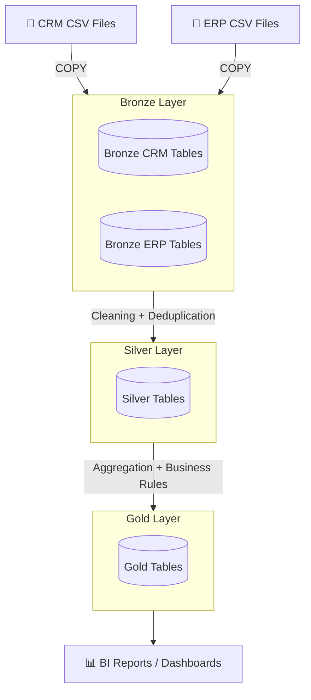

# ETL Data Flow: Bronze → Silver → Gold

```mermaid
flowchart TD
    %% External sources
    CRM[📂 CRM CSV Files] -->|COPY| BronzeLayer
    ERP[📂 ERP CSV Files] -->|COPY| BronzeLayer

    %% Bronze to Silver
    subgraph BronzeLayer[Bronze Layer]
        BronzeCRM[(Bronze CRM Tables)]
        BronzeERP[(Bronze ERP Tables)]
    end


%% Silver to Gold
    subgraph SilverLayer[Silver Layer]
        Silver[(Silver Tables)]
    end
    BronzeLayer -->|Cleaning + Deduplication| SilverLayer

    

    %% Gold to Reports
    subgraph GoldLayer[Gold Layer]
        Gold[(Gold Tables)]
    end


    SilverLayer -->|Aggregation + Business Rules| GoldLayer[(Gold Tables)]

    

    GoldLayer --> Reports[📊 BI Reports / Dashboards]
```
